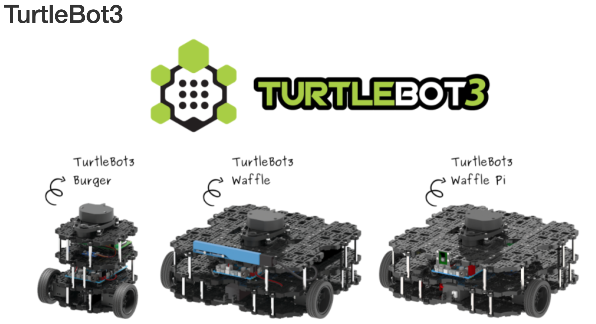
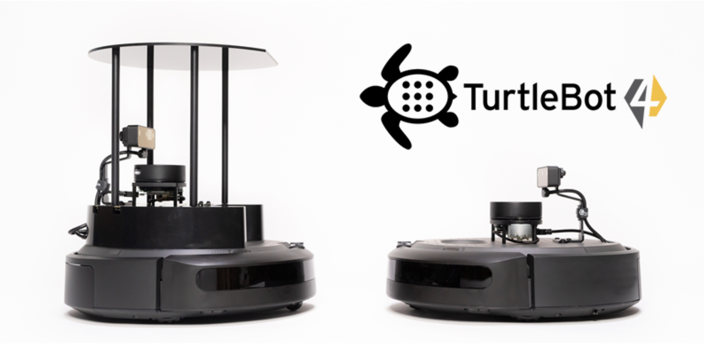

# tutlebot_review

* 기본 프로젝트 기반으로 진행하는 경우 해볼만 하다고 판단 됨.
  * 강사의 역활이 tutlebot의 기본 환경 setup 및 운영으로 한정된다면 준비 가능
    * 기존 강의 진행에 대한 자료 필요: 목표 및 교육과정의 범위 정의 필요
  * 준비 시간은 3주정도로 잡고 있음: tutlebot을 구매 또는 대여가 필요함
    * 기본 구동: 1주
    * Simulator(Gazebo) 기본: 1주
    * 강의 자료 준비(간이 교재): 1주
  * 추후 LiDA를 camera로 바꾸는 작업 진행: Kria KR260(K**V**260 아님) board 로 변경 검토
    * KV260 보드는 GPIO 부족으로 제어용 프로젝트로 부적합하다고 판단됨.

* 고려 사항
  * Robotics에 대한 교육에 대한 요구 정도
  * 서강대 강의 준비: 1월

# [Tutlebot](https://www.turtlebot.com/)

* **ROS(Robot Operating System) 기반의 저가형 개인용 모바일 로봇 키트**\
  : 저가라고 하지만 공식 사이트에서 가장 저렴한 것이 ₩798,600 (Raspi 4, 2G model)\
  LiDAR를 장착하고 있어 이해되는 가격입니다.
* 교육, 연구, 제품 개발 및 취미 등 다양한 분야에서 활용되는 **오픈소스 로봇 플랫폼**\
  : 미로 찾기 경주가 대학생들 위주로 진행

## 주요 특징

* **ROS 플랫폼:** 로봇 운영체제(ROS)를 사용하여 프로그래밍하고 다양한 기능을 구현할 수 있습니다.
* **오픈소스:** 소프트웨어뿐만 아니라 하드웨어 디자인 정보(회로도, 3D 도면 등)도 공개되어 있어 사용자가 자유롭게 수정하고 확장할 수 있습니다.
* **다양한 활용:** SLAM(동시적 위치 추정 및 지도 작성), 내비게이션(자율 주행), 물체 인식 등 모바일 로봇 기술을 학습하고 연구하는 데 적합합니다.
* **확장성 및 모듈형 구조:** 다양한 싱글 보드 컴퓨터(SBC), 센서, 모터를 적용하여 자유롭게 확장하고 조립, 유지보수가 쉽습니다.
* **주요 구성 요소:** 일반적으로 LiDAR(레이저 거리 센서), 카메라, IMU(관성 측정 장치), 엔코더 등을 탑재하여 주변 환경을 인식합니다.

현재 **터틀봇3 (TurtleBot3)**와 **터틀봇4 (TurtleBot4)**와 같은 여러 세대가 개발 및 판매되고 있습니다.

* **터틀봇3:** (주)로보티즈(ROBOTIS)와 Open Robotics의 협력으로 제작되었으며, 작은 크기와 저렴한 가격이 특징입니다. '버거(Burger)'와 '와플파이(Waffle Pi)' 등의 모델이 있습니다.

* **터틀봇4:** Open Robotics와 Clearpath Robotics의 협력으로 제작되었으며, iRobot® Create 3 모바일 베이스와 향상된 센서(LiDAR, OAK-D 카메라 등), ROS 2를 기본으로 탑재한 것이 특징입니다.

* 현재 국내 공식 판매점은 (주)로보티즈로 tutlebot3만 판매하고 있습니다.

-----
# SLAM: **S**imultaneous **L**ocalization **a**nd **M**apping

## 로봇 공학 및 컴퓨터 비전 분야의 핵심 기술 중 하나

## 1. SLAM의 정의 및 목적

SLAM은 로봇이나 자율 주행 차량과 같은 이동체가 **미지의 환경을 탐색**하면서 동시에 **자신의 위치를 파악**하고 **환경의 지도를 작성**하는 기술을 말합니다.

* **Localization (위치 추정):** "내가 지금 어디에 있는가?"에 답합니다. 로봇이 센서 데이터를 사용하여 지도 내에서 자신의 정확한 위치를 파정합니다.
* **Mapping (지도 작성):** "주변 환경은 어떻게 생겼는가?"에 답합니다. 센서 데이터를 사용하여 환경의 일관된 지도를 생성합니다.

이 두 가지 과정(위치 추정 및 지도 작성)은 서로에게 영향을 미치기 때문에 **동시에(Simultaneous)** 이루어져야 합니다. 좋은 지도가 있어야 정확한 위치 추정이 가능하고, 정확한 위치 추정이 이루어져야 좋은 지도를 만들 수 있습니다. 이 상호 의존적인 문제를 해결하는 것이 SLAM의 핵심입니다.

## 2. SLAM의 작동 원리

SLAM은 주로 센서 데이터를 기반으로 작동하며, 복잡한 확률적 모델링을 통해 오차를 보정합니다.

### A\. 사용되는 센서

    로봇은 환경 정보를 얻기 위해 다양한 센서를 사용합니다.
* **LiDAR (Light Detection and Ranging):** 레이저를 사용하여 정확한 거리 정보를 측정하여 2차원 또는 3차원 지도를 만드는 데 주로 사용됩니다. (예: 터틀봇의 LDS)
* **카메라 (Camera):** 시각 정보를 얻어 환경의 특징점(Feature)을 추출하고 이를 통해 위치를 추정하거나 지도를 구성합니다 (VSLAM, Visual SLAM).
* **IMU (Inertial Measurement Unit):** 가속도와 각속도를 측정하여 로봇의 움직임을 추정하는 데 사용됩니다.

### B\. 데이터 처리 과정 (오차 보정)

    로봇이 이동할 때마다 오차가 누적됩니다 (이를 **드리프트(drift)**라고 합니다). SLAM 알고리즘은 이 오차를 최소화하는 데 초점을 맞춥니다.

1. **예측 (Prediction):** 로봇의 움직임 데이터(바퀴 회전 수, IMU 등)를 기반으로 다음 위치와 지도를 예측합니다.
2. **관측 (Observation):** 센서(LiDAR, 카메라)를 통해 환경을 관측하고, 이 관측값과 이전에 생성된 지도를 비교합니다.
3. **갱신 (Update) & 루프 폐쇄 (Loop Closure):**
    * **갱신:** 예측과 관측 사이에 차이가 발생하면, 확률적 필터(예: 칼만 필터, 파티클 필터) 또는 그래프 최적화(Graph Optimization) 기법을 사용하여 위치 및 지도 정보를 갱신하고 오차를 보정합니다.
    * **루프 폐쇄:** 로봇이 이전에 방문했던 장소에 다시 돌아왔을 때, 센서 데이터가 일치하는 것을 확인하고 이전의 누적된 오차(드리프트)를 한 번에 교정하는 과정입니다. 이 과정은 SLAM의 정확도를 비약적으로 높여줍니다.
